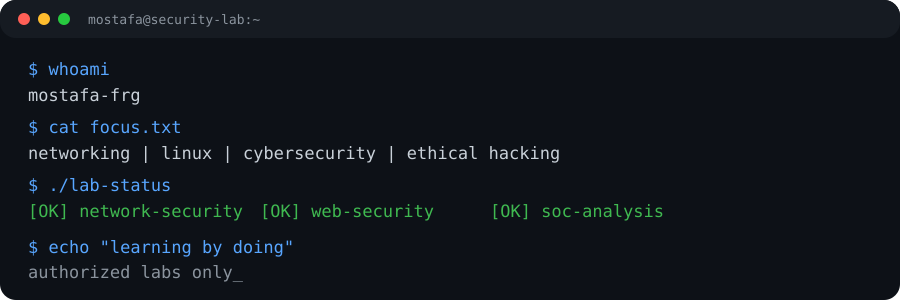

<div align="center">

# Mostafa Mahmoud

**IT Support • Networking • Linux • Cybersecurity**



Practical network engineering, security testing, Linux administration, and defensive security labs.

[](https://github.com/mostafa-frg/mostafa-frg/actions/workflows/lab-checks.yml)

</div>

---

## About

I build small, testable tools around the work I actually want to do: troubleshooting networks, validating configurations, analyzing security data, and automating repetitive tasks.

The repository is intentionally practical. Most labs take local input or supplied evidence rather than depending on a live production environment.

## Focus

- Network engineering and troubleshooting
- Linux administration and shell tooling
- Web and API security
- SOC and log analysis
- Security testing in controlled environments
- Network automation

## Projects

### Network Engineering & Security

- [Network Toolkit](cyber-labs/network-toolkit/) — subnet, DNS, TCP connectivity, and inventory diagnostics
- [Network Security Lab](cyber-labs/network-security-lab/) — authorized TCP service inventory with JSON reporting
- [Network Monitor](cyber-labs/network-monitor/) — periodic TCP health checks with JSONL events
- [Subnet Planner](cyber-labs/subnet-planner/) — IPv4 subnet allocation and capacity planning
- [IPAM Lab](cyber-labs/ipam/) — CSV-backed IPv4 address allocation
- [VLAN Lab](cyber-labs/vlan-lab/) — access/trunk and VLAN consistency validation
- [Firewall Rule Validator](cyber-labs/firewall-rule-validator/) — offline ACL overlap, conflict, and shadowing checks
- [Network Config Auditor](cyber-labs/network-config-auditor/) — Cisco-style configuration security checks
- [Network Automation Lab](cyber-labs/network-automation-lab/) — repeatable IOS-style configuration generation
- [Topology Builder](cyber-labs/topology-builder/) — CSV-to-Graphviz topology generation
- [NetFlow Analyzer](cyber-labs/netflow-parser/) — offline traffic-flow aggregation
- [DNS & DHCP Lab](cyber-labs/dns-dhcp-lab/) — local DNS/DHCP troubleshooting lab
- [PCAP Analysis Lab](cyber-labs/pcap-analysis/) — offline packet and DNS analysis
- [OSPF Lab](cyber-labs/ospf-lab/) — router-ID, area, and network validation
- [STP Lab](cyber-labs/stp-lab/) — bridge identity and priority consistency checks
- [NAT Policy Lab](cyber-labs/nat-lab/) — offline IPv4 NAT policy validation
- [SNMP Audit](cyber-labs/snmp-audit/) — configuration review for insecure SNMP settings
- [Syslog Analyzer](cyber-labs/syslog-analyzer/) — network-device syslog aggregation
- [ACL Policy Lab](cyber-labs/acl-policy-lab/) — offline access-control policy validation
- [Routing Lab](cyber-labs/routing-lab/) — offline route validation and analysis
- [Network Operations Lab](cyber-labs/network-operations-lab/) — isolated Docker topology with services and health checks
- [Network Engineering Suite](cyber-labs/network-engineering-suite/) — IP validation, longest-prefix route lookup, and inventory tooling
- [Network Config Compliance](cyber-labs/config-compliance/) — deterministic Cisco-style configuration compliance checks
- [Network Incident Triage](cyber-labs/incident-network-triage/) — network event timeline and severity analysis

### Linux / Termux

- [Mosta Terminal](cyber-labs/mosta-terminal/) — Linux/Termux launchers with `Mosta` terminal branding and short aliases
- [Linux Network Toolbox](cyber-labs/linux-network-toolbox/) — interfaces, routes, DNS, and TCP diagnostics
- [Security Tool Catalog](cyber-labs/tool-catalog/) — categorized Linux/Termux security-tool reference
- [Mosta Tool Index](cyber-labs/mosta-tool-index/) — upstream tool to Mosta alias map (`mnmap`, `mmasscan`, `mdnsrecon`, ...)

### Termux Quick Start

The repository can be installed as a native Mosta command layer on Termux:

```bash
cd cyber-labs/mosta-terminal
chmod +x install.sh
./install.sh
mosta-doctor
```

Core commands include `mnet`, `mhttp`, `mpcap`, `msoc`, `mconf`, `mroute`, `mtriage`, and `mtool`. Every lab also has a short command: `mvlan`, `mfw`, `mospf`, `mstp`, `mnat`, `macl`, `msnmp`, `msyslog`, `mflow`, `mipam`, `msubnet`, `mtopo`, `mad`, `mpriv`, `mreport`, `mcfg`, `mdns`, `mmon`, `mscan`, and `mauto`. Native networking tools are exposed through `mnmap`, `mnc`, `mdig`, `mtcpdump`, and related Mosta aliases.

### Enterprise Security

- [Active Directory Security Lab](cyber-labs/active-directory-security-lab/) — offline account and privilege auditing
- [Privilege Escalation Lab](cyber-labs/privilege-escalation-lab/) — Linux privilege-boundary checks

### Web Security

- [Web Security Lab](cyber-labs/web-security-lab/) — local web-security exercises
- [API Security Lab](cyber-labs/api-security-lab/) — authentication and authorization testing
- [CTF Web Security Lab](cyber-labs/ctf-web-lab/) — controlled vulnerable web challenges
- [HTTP Security Auditor](cyber-labs/http-security-auditor/) — HTTP security-header assessment

### Blue Team & Reporting

- [SOC Log Analyzer](cyber-labs/soc-log-analyzer/) — SSH authentication-log analysis
- [Security Assessment Report Template](cyber-labs/security-report-template/) — repeatable security-report generation

## Validation

Every change runs through GitHub Actions. The CI job currently checks:

- Python compilation and CLI help paths
- unit and integration tests (unittest and pytest)
- offline lab fixtures and negative cases
- PCAP analysis with generated test traffic
- local HTTP and Flask lab behavior
- shell syntax and terminal launchers
- Docker Compose configuration

The security labs are scoped to localhost, supplied evidence, offline analysis, or environments where testing is explicitly authorized.

## Tools

`Linux` `Python` `Bash` `Git` `TCP/IP` `IPv4` `DNS` `DHCP` `VLAN` `Routing` `ACL` `IPAM` `PCAP` `Network Automation` `Web Security` `SOC`

---

<div align="center">

**Build it. Test it. Understand it.**

</div>
